``` r
library(Seurat)
library(patchwork)
library(ggplot2)
library(dplyr)
library(RCurl)
library(AnnotationHub)
set.seed(30)
```

Adding metadata

``` r
#filepaths <- names(assays)
meta <- read.delim("samplesheet.tsv")

#making a better metadata table
get.par <- function(string){return(substring(string,1,12))}
get.tumor <- function(string){return(substring(string,14))}

metaf <- meta %>% mutate("participant" = get.par(sample_id)) %>% mutate("tumor.type" = get.tumor(sample_id))
```

``` r
assays <- list()

for(type in metaf$tumor.type){
  files <- metaf %>% dplyr::filter(tumor.type == type) %>% dplyr::select(filename)
  for(file in files[[1]]){
    data <- Read10X_h5(file)
    seurat.obj <- CreateSeuratObject(counts = data,
                                     min.features = 200,
                                     project = file)
    assign(file, seurat.obj)
  }
  assays[[type]] <- seurat.obj
}
```

``` r
merged.obj <- merge(x = assays$normal,
                      y = c(assays$edge, assays$middle, assays$core), 
                      add.cell.id = c("ctrl", "edge", "middle", "core"))

merged.obj <- JoinLayers(merged.obj)

head(merged.obj@meta.data)
```

    ##                                    orig.ident nCount_RNA nFeature_RNA
    ## ctrl_AAACCTGCACGCTTTC counts/scrBT1428_raw.h5        975          227
    ## ctrl_AAACCTGGTAGCGTGA counts/scrBT1428_raw.h5       1508          302
    ## ctrl_AAACGGGAGGTGGGTT counts/scrBT1428_raw.h5        858          212
    ## ctrl_AAACGGGAGTGTCCAT counts/scrBT1428_raw.h5        814          222
    ## ctrl_AAAGATGAGCCTATGT counts/scrBT1428_raw.h5        824          267
    ## ctrl_AAAGATGAGTACGTAA counts/scrBT1428_raw.h5       1034          306

``` r
#for(name in list.files("./counts", full.names = T)){
#  if(grepl("filtered.h5", name)){
#    assays[name] <- CreateSeuratObject(counts = #Read10X_h5(name), project = name)
    #}
#}
```

``` r
#novelty score
# Add number of genes per UMI for each cell to metadata
merged.obj$log10GenesPerUMI <- log10(merged.obj$nFeature_RNA) / log10(merged.obj$nCount_RNA)

#add mitoRatio

# Compute percent mito ratio
merged.obj$mitoRatio <- PercentageFeatureSet(object = merged.obj, pattern = "^MT-")
merged.obj$mitoRatio <- merged.obj@meta.data$mitoRatio / 100
```

``` r
#create meta datatable
metadata <- merged.obj@meta.data
metadata$cells <- rownames(metadata)

#sample column 
metadata <- metadata  %>% mutate(sample = case_when(
                                      grepl("core", cells) ~ "core",
                                      grepl("edge", cells) ~ "edge",
                                      grepl("ctrl", cells) ~ "ctrl",
                                      grepl("middle", cells) ~ "middle")) %>% 
                        dplyr::rename(nUMI = nCount_RNA, nGene = nFeature_RNA)

head(metadata)
```

    ##                                    orig.ident nUMI nGene log10GenesPerUMI
    ## ctrl_AAACCTGCACGCTTTC counts/scrBT1428_raw.h5  975   227        0.7882309
    ## ctrl_AAACCTGGTAGCGTGA counts/scrBT1428_raw.h5 1508   302        0.7802687
    ## ctrl_AAACGGGAGGTGGGTT counts/scrBT1428_raw.h5  858   212        0.7930274
    ## ctrl_AAACGGGAGTGTCCAT counts/scrBT1428_raw.h5  814   222        0.8061339
    ## ctrl_AAAGATGAGCCTATGT counts/scrBT1428_raw.h5  824   267        0.8321577
    ## ctrl_AAAGATGAGTACGTAA counts/scrBT1428_raw.h5 1034   306        0.8245827
    ##                         mitoRatio                 cells sample
    ## ctrl_AAACCTGCACGCTTTC 0.004102564 ctrl_AAACCTGCACGCTTTC   ctrl
    ## ctrl_AAACCTGGTAGCGTGA 0.006631300 ctrl_AAACCTGGTAGCGTGA   ctrl
    ## ctrl_AAACGGGAGGTGGGTT 0.017482517 ctrl_AAACGGGAGGTGGGTT   ctrl
    ## ctrl_AAACGGGAGTGTCCAT 0.004914005 ctrl_AAACGGGAGTGTCCAT   ctrl
    ## ctrl_AAAGATGAGCCTATGT 0.008495146 ctrl_AAAGATGAGCCTATGT   ctrl
    ## ctrl_AAAGATGAGTACGTAA 0.006769826 ctrl_AAAGATGAGTACGTAA   ctrl

It looks like we’re getting far fewer cells than expected (4K, really?)

``` r
metadata %>% 
    ggplot(aes(x=sample, fill=sample)) + 
    geom_bar() +
    theme_classic() +
    theme(axis.text.x = element_text(angle = 45, vjust = 1, hjust=1)) +
    theme(plot.title = element_text(hjust=0.5, face="bold")) +
    ggtitle("NCells")
```

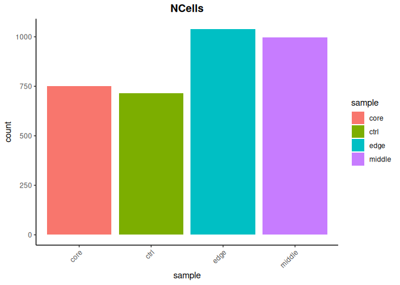

Looks alright, for some reason ctrl is much different. Sampling issues
or celltype differences?

``` r
#plotting
metadata %>% ggplot(aes(colour = sample, x=nUMI, fill = sample)) + 
  geom_density(alpha=0.4) +
  scale_x_log10() + 
  theme_classic() + 
  geom_vline(xintercept = 400)
```

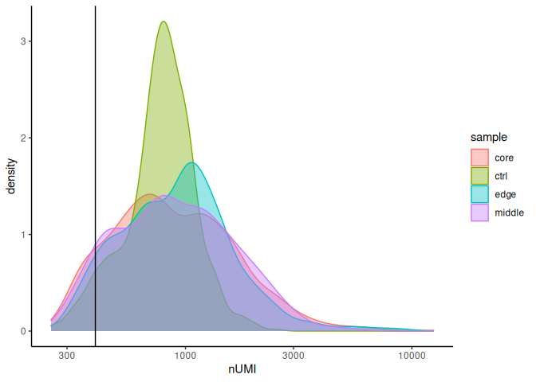 We
have a pretty low gene detection rate at a mean of ~300. Ctl sample
seems much more consistent which may indicate a lesser diversity of cell
types.

``` r
metadata %>% ggplot(aes(colour = sample, x=nGene, fill = sample)) + 
  geom_density(alpha=0.4) +
  scale_x_log10() + 
  theme_classic()
```

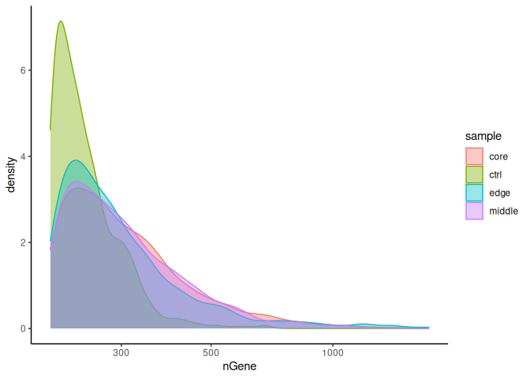

``` r
mean(metadata$nGene)
```

    ## [1] 309.161

``` r
median(metadata$nGene)
```

    ## [1] 264

Evaluating complexity (nGene/nUMI). Some really interesting stuff here,
it looks like the edge sample is bimodal, which might actually represent
the spatial stratification of the sample. The control has a bump at 0.9
which is indicative of some heterogeneity. I feel like 0.8 might be too
harsh a cut-off and we’d lose something interesting in the edge sample.

``` r
metadata %>% ggplot(aes(colour = sample, x=log10GenesPerUMI, fill = sample)) + 
  geom_density(alpha=0.4) +
  theme_classic() +
  geom_vline(xintercept = 0.76)
```

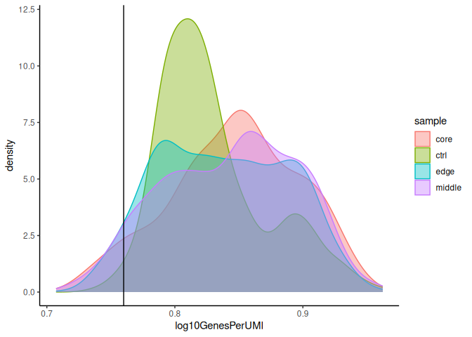 No
mitochondrial

``` r
metadata %>% ggplot(aes(colour = sample, x=mitoRatio, fill = sample)) + 
  geom_density(alpha=0.4) +
  theme_classic() +
  scale_x_log10() +
  geom_vline(xintercept = 0.2)
```

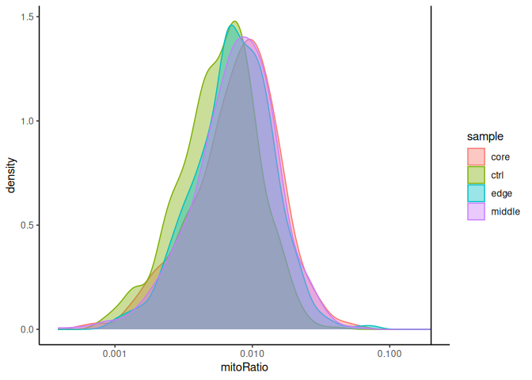

Mitochondrial expression seems to prevalent in edge tumor cells that are
highly expressive. Since mito expression is very broad we probably
shouldn’t filter cells on this basis.

``` r
metadata %>% 
    ggplot(aes(x=nUMI, y=nGene, color=mitoRatio)) + 
    geom_point(size = 0.9) + 
    scale_colour_gradient(low = "gray90", high = "black") +
    stat_smooth(method=lm) +
    scale_x_log10() + 
    scale_y_log10() + 
    theme_classic() +
    geom_vline(xintercept = 500) +
    geom_hline(yintercept = 250) +
    facet_wrap(~sample) 
```

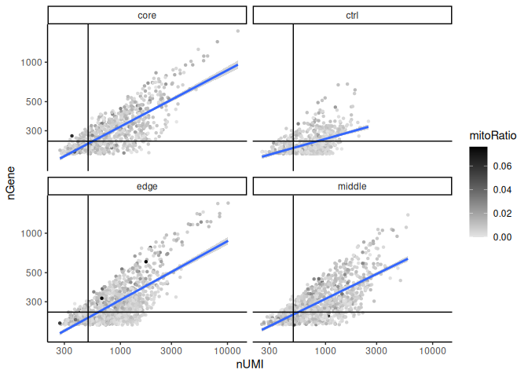

## Filtering

``` r
#first lets throw the metadata on the object
merged.obj@meta.data <- metadata

filtered.seurat <- subset(x = merged.obj, 
                          subset= (nUMI >= 400) & 
                          (nGene >= 200) & 
                          (log10GenesPerUMI >= 0.76))
```

``` r
# Extract counts
counts <- GetAssayData(object = filtered.seurat, layer = "counts")
nonzero <- counts > 0


# Sums all TRUE values and returns TRUE if more than 10 TRUE values per gene
keep_genes <- Matrix::rowSums(nonzero) >= 10

# Only keeping those genes expressed in more than 10 cells
filtered_counts <- counts[keep_genes, ]
filtered.seurat <- CreateSeuratObject(filtered_counts, meta.data = filtered.seurat@meta.data)
```

Checking after filtering

``` r
filtered.seurat@meta.data %>% 
    ggplot(aes(x=nUMI, y=nGene, color=mitoRatio)) + 
    geom_point(size = 0.9) + 
    scale_colour_gradient(low = "gray90", high = "black") +
    stat_smooth(method=lm) +
    scale_x_log10() + 
    scale_y_log10() + 
    theme_classic() +
    geom_vline(xintercept = 400) +
    geom_hline(yintercept = 200) +
    facet_wrap(~sample) 
```

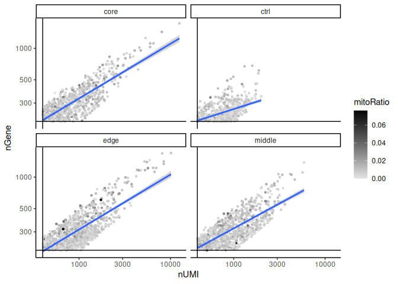

``` r
filtered.seurat@meta.data %>% 
    ggplot(aes(x=sample, fill=sample)) + 
    geom_bar() +
    theme_classic() +
    theme(axis.text.x = element_text(angle = 45, vjust = 1, hjust=1)) +
    theme(plot.title = element_text(hjust=0.5, face="bold")) +
    ggtitle("NCells")
```

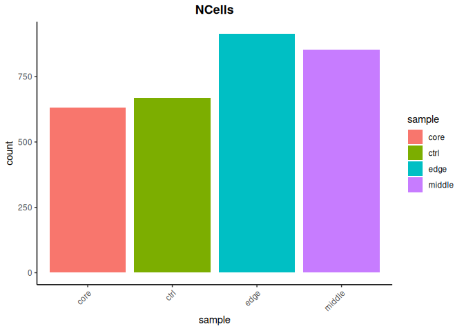

## Cell cycle analysis

``` r
cc_file <- getURL("https://raw.githubusercontent.com/hbc/tinyatlas/master/cell_cycle/Homo_sapiens.csv") 
cell_cycle_genes <- read.csv(text = cc_file)
```

Getting annotations

``` r
ah <- AnnotationHub()
ahDb <- query(ah, 
              pattern = c("Homo sapiens", "EnsDb"), 
              ignore.case = TRUE)
id <- ahDb %>%
        mcols() %>%
        rownames() %>%
        tail(n = 1)

edb <- ah[[id]]
```

    ## loading from cache

    ## require("ensembldb")

``` r
annotations <- genes(edb, 
                     return.type = "data.frame")

annotations <- annotations %>%
        dplyr::select(gene_id, gene_name, seq_name, gene_biotype, description)
```

Getting gene IDs map to cell cycle ensembl IDs

``` r
# Get gene names for Ensembl IDs for each gene
cell_cycle_markers <- dplyr::left_join(cell_cycle_genes, annotations, by = c("geneID" = "gene_id"))

# Acquire the S phase genes
s_genes <- cell_cycle_markers %>%
        dplyr::filter(phase == "S") %>%
        pull("gene_name")
        
# Acquire the G2M phase genes        
g2m_genes <- cell_cycle_markers %>%
        dplyr::filter(phase == "G2/M") %>%
        pull("gene_name")
```

Cell cycle scoring

``` r
seurat.phase <- NormalizeData(filtered.seurat)
```

    ## Normalizing layer: counts

``` r
seurat.phase <- CellCycleScoring(seurat.phase, 
                                 g2m.features = g2m_genes, 
                                 s.features = s_genes)
```

    ## Warning: The following features are not present in the object: UBR7, RFC2,
    ## MCM2, MCM6, UNG, POLD3, CDC45, CDC6, MSH2, MCM5, POLA1, MCM4, RAD51AP1, GMNN,
    ## CASP8AP2, E2F8, GINS2, PCNA, BRIP1, DSCC1, DTL, CDCA7, ATAD2, CHAF1B, USP1,
    ## SLBP, RRM1, FEN1, EXO1, BLM, PRIM1, not searching for symbol synonyms

    ## Warning: The following features are not present in the object: NCAPD2, ANLN,
    ## TACC3, HMMR, GTSE1, NDC80, AURKA, TPX2, BIRC5, G2E3, RANGAP1, CDCA3, TTK, ECT2,
    ## CENPA, CDC20, NEK2, CENPF, TMPO, HJURP, CKS2, DLGAP5, TOP2A, PSRC1, CDCA8,
    ## CKAP2, KIF23, KIF20B, CENPE, GAS2L3, KIF2C, NUF2, LBR, MKI67, CCNB2, HMGB2,
    ## CKAP2L, BUB1, CDK1, CKS1B, UBE2C, CKAP5, AURKB, CDCA2, not searching for symbol
    ## synonyms

``` r
head(seurat.phase@meta.data)  
```

    ##                                    orig.ident nCount_RNA nFeature_RNA nUMI
    ## ctrl_AAACCTGCACGCTTTC counts/scrBT1428_raw.h5        969          221  975
    ## ctrl_AAACCTGGTAGCGTGA counts/scrBT1428_raw.h5       1501          295 1508
    ## ctrl_AAACGGGAGGTGGGTT counts/scrBT1428_raw.h5        858          212  858
    ## ctrl_AAACGGGAGTGTCCAT counts/scrBT1428_raw.h5        811          219  814
    ## ctrl_AAAGATGAGCCTATGT counts/scrBT1428_raw.h5        818          261  824
    ## ctrl_AAAGATGAGTACGTAA counts/scrBT1428_raw.h5       1023          296 1034
    ##                       nGene log10GenesPerUMI   mitoRatio                 cells
    ## ctrl_AAACCTGCACGCTTTC   227        0.7882309 0.004102564 ctrl_AAACCTGCACGCTTTC
    ## ctrl_AAACCTGGTAGCGTGA   302        0.7802687 0.006631300 ctrl_AAACCTGGTAGCGTGA
    ## ctrl_AAACGGGAGGTGGGTT   212        0.7930274 0.017482517 ctrl_AAACGGGAGGTGGGTT
    ## ctrl_AAACGGGAGTGTCCAT   222        0.8061339 0.004914005 ctrl_AAACGGGAGTGTCCAT
    ## ctrl_AAAGATGAGCCTATGT   267        0.8321577 0.008495146 ctrl_AAAGATGAGCCTATGT
    ## ctrl_AAAGATGAGTACGTAA   306        0.8245827 0.006769826 ctrl_AAAGATGAGTACGTAA
    ##                       sample     S.Score   G2M.Score Phase
    ## ctrl_AAACCTGCACGCTTTC   ctrl -0.03071600 -0.05212190    G1
    ## ctrl_AAACCTGGTAGCGTGA   ctrl -0.03866397 -0.03401937    G1
    ## ctrl_AAACGGGAGGTGGGTT   ctrl -0.02677271 -0.03028703    G1
    ## ctrl_AAACGGGAGTGTCCAT   ctrl -0.04371395 -0.06337812    G1
    ## ctrl_AAAGATGAGCCTATGT   ctrl  0.35953352  0.20274757     S
    ## ctrl_AAAGATGAGTACGTAA   ctrl -0.04513755  0.16088568   G2M

``` r
# Identify the most variable genes
seurat.phase <- FindVariableFeatures(seurat.phase, 
                     selection.method = "vst",
                     nfeatures = 2000, 
                     verbose = FALSE)
             
# Scale the counts
seurat.phase <- ScaleData(seurat.phase)
```

    ## Centering and scaling data matrix

``` r
# Identify the 15 most highly variable genes
ranked_variable_genes <- VariableFeatures(seurat.phase)
top_genes <- ranked_variable_genes[1:15]

# Plot the average expression and variance of these genes
# With labels to indicate which genes are in the top 15
p <- VariableFeaturePlot(seurat.phase)
LabelPoints(plot = p, points = top_genes, repel = TRUE)
```

    ## When using repel, set xnudge and ynudge to 0 for optimal results

    ## Warning: ggrepel: 7 unlabeled data points (too many overlaps). Consider
    ## increasing max.overlaps

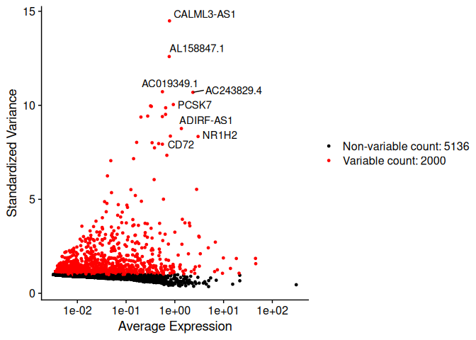

``` r
# Perform PCA
seurat.phase <- RunPCA(seurat.phase)
```

    ## PC_ 1 
    ## Positive:  ADIRF-AS1, YIF1B, CALML3-AS1, CTTN, LTO1, AC008655.1, AL158847.1, BX470102.2, LNCOC1, ENAH 
    ##     AC078816.1, AC018761.2, CCDC152, AC010761.5, AC019349.1, PDGFRL, UQCC2, COX11, NR1H2, TMTC3 
    ##     ELP2, SHISA2, AC079328.2, NHSL1, DGCR6, AC005722.4, LINC00668, AATK, RUSC1-AS1, FAAP20 
    ## Negative:  AC020656.1, LYZ, HLA-DQB1-AS1, PCAT7, MSR1, DNAJC17, TMEM52B, SNAP25-AS1, AXL, FGD2 
    ##     SLCO2B1, AC011603.2, CYBB, AC084871.3, SIGLEC14, AC243829.4, APOE, B3GNT7, MGAM, AC005786.3 
    ##     TIMMDC1, AC023194.3, VCAN-AS1, DPEP2, WDR61, TM4SF19-AS1, SRGAP2, PADI2, AC245297.3, TDRD6 
    ## PC_ 2 
    ## Positive:  NR1H2, GPRC5A, PIGR, HPS3, SFTPB, PARD6B, SDC4, MTHFR, ATP13A4, SGCE 
    ##     WDR11, MAZ, F3, AL034417.4, SCGB3A2, AC009088.3, LRP2BP, PON2, ATF7, AC051619.6 
    ##     SFTPC, PDGFRL, CCDC152, TFPI, AC008655.1, LMO3, AC091053.1, FAAP20, AL080250.1, ERI2 
    ## Negative:  CALML3-AS1, BX470102.2, LNCOC1, AC078816.1, LINC00668, AC019349.1, AC005722.4, AL158847.1, MALSU1, AKT3 
    ##     AC009119.1, CD72, ITFG2, CBR3-AS1, AC006064.4, AC092718.2, GINS3, AC139100.1, AC007279.2, AC125611.4 
    ##     CREB3, KRT17, KRT6A, PAQR4, KRT14, SERPINB11, APOBEC3B-AS1, AC005841.1, SLC15A1, AP000688.1 
    ## PC_ 3 
    ## Positive:  BX322234.1, COL1A1, AC007750.1, SLIT2, AP003396.5, RTRAF, CRISPLD2, FGF14, AL445183.1, MEIS1 
    ##     ACTA2-AS1, MYLK-AS1, AC002398.2, POLR2B, BICC1, COL1A2, TARID, AP003071.3, SLC19A1, STEAP2 
    ##     PCSK7, MIR100HG, A2M-AS1, CDH6, NOC2L, HELLPAR, RBMS3, AC011365.2, TREH, AC091564.4 
    ## Negative:  YIF1B, NME7, AC008655.1, NR1H2, DNAJC17, PDGFRL, CALML3-AS1, AC009088.3, LTO1, AC011479.4 
    ##     AATK, GPRC5A, DGCR6, ADIRF-AS1, ATP1B1, AC078816.1, BX470102.2, PARD6B, LNCOC1, PIGR 
    ##     PCAT7, MALSU1, AC020656.1, AC019349.1, MSR1, B3GNT7, ATF7, CXADR, MAZ, UQCC2 
    ## PC_ 4 
    ## Positive:  MSR1, DNAJC17, AC020656.1, PCSK7, LYZ, SLC7A8, SLIT2, SNAP25-AS1, BX322234.1, PCAT7 
    ##     AC007750.1, COL1A1, ITGB8, AP003396.5, RTRAF, B3GNT7, MYLK-AS1, CRISPLD2, AL445183.1, VCAN-AS1 
    ##     MEIS1, ENAH, FGF14, AP003071.3, CALML3-AS1, A2M-AS1, BX470102.2, AC078816.1, AKT3, LNCOC1 
    ## Negative:  AC114271.1, AC010761.1, CD27-AS1, C1orf74, PRDM1, PIM2, TMEM120B, CD3G, SMARCB1, JAK3 
    ##     LINC-PINT, JCHAIN, AC109460.4, SERPINB9, AC058791.1, ADAM19, PSMB8-AS1, DDIT4-AS1, AC006064.4, AL031733.2 
    ##     DTNB, ZNF740, ESPN, CBX5, IGKC, IGHG3, AL035530.2, ENOSF1, CCR4, PRICKLE3 
    ## PC_ 5 
    ## Positive:  HNRNPH1, CDC42SE1, CTNNB1, SET, YWHAE, PPP1CB, APOBEC3C, SUMF2, GOLIM4, TSPYL1 
    ##     B4GALT1, ATP1B1, CALR, AMFR, FGD2, PPP3CA, MSR1, SETD5, FOXP1, APOL2 
    ##     AXL, STAT2, RSRC1, KMT5A, B3GNT7, GLTP, ZC3H4, TLK1, IRF2BPL, C16orf54 
    ## Negative:  MIF-AS1, AC006064.4, AC005786.3, AC011511.5, SMARCB1, AC243829.4, BMP6, SPP1, TM4SF19-AS1, IGKC 
    ##     EME1, AC073263.1, JCHAIN, IGHG3, MGAM, AC018761.2, DTNB, PCAT7, AC125611.3, GATC 
    ##     AC145207.4, TECPR1, AC131944.1, AC068733.3, LRRC28, OGG1, TSPAN31, PDK1, SLA2, P4HA2-AS1

``` r
# Plot the PCA colored by cell cycle phase
DimPlot(seurat.phase,
        reduction = "pca",
        group.by= "Phase",
        split.by = "Phase")
```

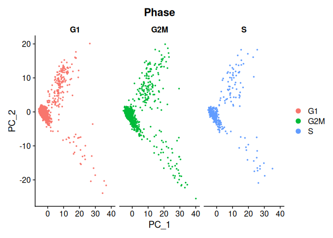

``` r
DimPlot(seurat.phase,
        reduction = "pca",
        group.by= "Phase")
```

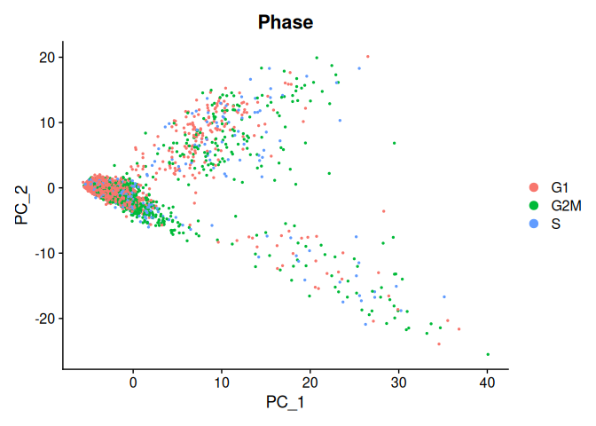
There is some variation with G2M and G1 in both PCs. However, since this
is a stratified tumor dataset, we should expect some differentiation.
There won’t be any need to regress out phase information.

Splitting data for SCT normalization. Here we are just regressing gene
length

``` r
split.seurat <- SplitObject(seurat.phase, split.by = "sample")
splits.assays <- sapply(split.seurat, SCTransform, vst.flavor = "v2")
```

``` r
splits.assays$ctrl@assays
```

    ## $RNA
    ## Assay (v5) data with 7136 features for 668 cells
    ## Top 10 variable features:
    ##  CALML3-AS1, AL158847.1, AC019349.1, AC243829.4, PCSK7, OR2I1P, JCHAIN,
    ## SMARCB1, CCL22, SERPINB11 
    ## Layers:
    ##  counts, data, scale.data 
    ## 
    ## $SCT
    ## SCTAssay data with 3534 features for 668 cells, and 1 SCTModel(s) 
    ## Top 10 variable features:
    ##  NR1H2, ADIRF-AS1, PIGR, AC011511.5, MSR1, CCDC152, YIF1B, AC243829.4,
    ## GPRC5A, ENOSF1

``` r
splits.assays$core@assays
```

    ## $RNA
    ## Assay (v5) data with 7136 features for 631 cells
    ## Top 10 variable features:
    ##  CALML3-AS1, AL158847.1, AC019349.1, AC243829.4, PCSK7, OR2I1P, JCHAIN,
    ## SMARCB1, CCL22, SERPINB11 
    ## Layers:
    ##  counts, data, scale.data 
    ## 
    ## $SCT
    ## SCTAssay data with 4875 features for 631 cells, and 1 SCTModel(s) 
    ## Top 10 variable features:
    ##  NR1H2, AC243829.4, SMARCB1, ADIRF-AS1, LYZ, PCSK7, CCDC152, IGKC,
    ## SIGLEC6, JCHAIN

## Clustering

SMARCB1, a known tumor suppressor is a good indicator we’re on the right
track for one of the most variable genes.

``` r
seurat.phase <- RunUMAP(seurat.phase, dims = 1:40)
```

    ## Warning: The default method for RunUMAP has changed from calling Python UMAP via reticulate to the R-native UWOT using the cosine metric
    ## To use Python UMAP via reticulate, set umap.method to 'umap-learn' and metric to 'correlation'
    ## This message will be shown once per session

    ## 14:54:04 UMAP embedding parameters a = 0.9922 b = 1.112

    ## 14:54:04 Read 3067 rows and found 40 numeric columns

    ## 14:54:04 Using Annoy for neighbor search, n_neighbors = 30

    ## 14:54:04 Building Annoy index with metric = cosine, n_trees = 50

    ## 0%   10   20   30   40   50   60   70   80   90   100%

    ## [----|----|----|----|----|----|----|----|----|----|

    ## **************************************************|
    ## 14:54:05 Writing NN index file to temp file /tmp/RtmpOW2YM0/file29f92f6878eaa8
    ## 14:54:05 Searching Annoy index using 1 thread, search_k = 3000
    ## 14:54:05 Annoy recall = 100%
    ## 14:54:06 Commencing smooth kNN distance calibration using 1 thread with target n_neighbors = 30
    ## 14:54:07 Initializing from normalized Laplacian + noise (using RSpectra)
    ## 14:54:07 Commencing optimization for 500 epochs, with 134802 positive edges
    ## 14:54:10 Optimization finished

``` r
UMAPPlot(seurat.phase)
```

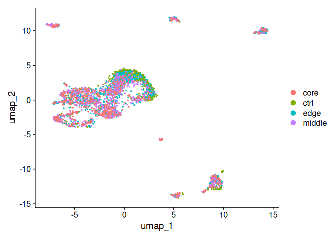 We
can see some tight clustering for specific subgroups emerging, however
its difficult to see the differentiation. Let’s try adjusting the
parameters.

``` r
seurat.phase <- RunUMAP(seurat.phase, dims = 1:40, min.dist = 0.80, n.neighbors = 30)
```

    ## 14:54:11 UMAP embedding parameters a = 0.2321 b = 1.681

    ## 14:54:11 Read 3067 rows and found 40 numeric columns

    ## 14:54:11 Using Annoy for neighbor search, n_neighbors = 30

    ## 14:54:11 Building Annoy index with metric = cosine, n_trees = 50

    ## 0%   10   20   30   40   50   60   70   80   90   100%

    ## [----|----|----|----|----|----|----|----|----|----|

    ## **************************************************|
    ## 14:54:11 Writing NN index file to temp file /tmp/RtmpOW2YM0/file29f92fbff80bf
    ## 14:54:11 Searching Annoy index using 1 thread, search_k = 3000
    ## 14:54:11 Annoy recall = 100%
    ## 14:54:12 Commencing smooth kNN distance calibration using 1 thread with target n_neighbors = 30
    ## 14:54:13 Initializing from normalized Laplacian + noise (using RSpectra)
    ## 14:54:13 Commencing optimization for 500 epochs, with 134802 positive edges
    ## 14:54:17 Optimization finished

``` r
UMAPPlot(seurat.phase)
```

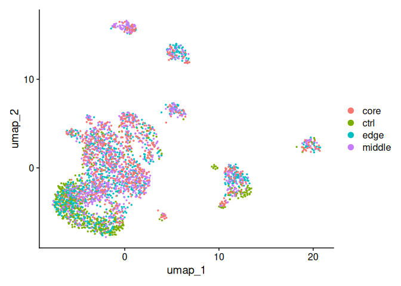 Here
we can see the differences in the main cluster. “Edge” and “CTRL”
samples seem to occupy a similar space at the lower end. We can also see
clusters that are exclusive to the tumor samples. This dataset looks
like it could benefit from integration.

``` r
## Don't run this during class
# Select the most variable features to use for integration
integ_features <- SelectIntegrationFeatures(object.list = splits.assays, 
                                            nfeatures = 2000)
## Don't run this during class
# Prepare the SCT list object for integration
splits.assays <- PrepSCTIntegration(object.list = splits.assays, 
                                   anchor.features = integ_features)

## Don't run this during class
# Find best buddies - can take a while to run
integ_anchors <- FindIntegrationAnchors(object.list = splits.assays, 
                                        normalization.method = "SCT", 
                                        anchor.features = integ_features)
```

    ## Finding all pairwise anchors

    ## Running CCA

    ## Merging objects

    ## Finding neighborhoods

    ## Finding anchors

    ##  Found 2610 anchors

    ## Filtering anchors

    ##  Retained 2128 anchors

    ## Running CCA

    ## Merging objects

    ## Finding neighborhoods

    ## Finding anchors

    ##  Found 2587 anchors

    ## Filtering anchors

    ##  Retained 2080 anchors

    ## Running CCA

    ## Merging objects

    ## Finding neighborhoods

    ## Finding anchors

    ##  Found 2710 anchors

    ## Filtering anchors

    ##  Retained 2604 anchors

    ## Running CCA

    ## Merging objects

    ## Finding neighborhoods

    ## Finding anchors

    ##  Found 2230 anchors

    ## Filtering anchors

    ##  Retained 1902 anchors

    ## Running CCA

    ## Merging objects

    ## Finding neighborhoods

    ## Finding anchors

    ##  Found 2300 anchors

    ## Filtering anchors

    ##  Retained 2247 anchors

    ## Running CCA

    ## Merging objects

    ## Finding neighborhoods

    ## Finding anchors

    ##  Found 2323 anchors

    ## Filtering anchors

    ##  Retained 2283 anchors

``` r
## Don't run this during class
# Integrate across conditions
seurat_integrated <- IntegrateData(anchorset = integ_anchors, 
                                   normalization.method = "SCT")
```

    ## [1] 1

    ## Warning: Different cells and/or features from existing assay SCT

    ## Warning: Layer counts isn't present in the assay object; returning NULL

    ## [1] 2

    ## Warning: Different cells and/or features from existing assay SCT
    ## Layer counts isn't present in the assay object; returning NULL

    ## [1] 3

    ## Warning: Different cells and/or features from existing assay SCT
    ## Layer counts isn't present in the assay object; returning NULL

    ## [1] 4

    ## Warning: Different cells and/or features from existing assay SCT
    ## Layer counts isn't present in the assay object; returning NULL

    ## Merging dataset 4 into 3

    ## Extracting anchors for merged samples

    ## Finding integration vectors

    ## Finding integration vector weights

    ## Integrating data

    ## Warning: Layer counts isn't present in the assay object; returning NULL

    ## Merging dataset 1 into 2

    ## Extracting anchors for merged samples

    ## Finding integration vectors

    ## Finding integration vector weights

    ## Integrating data

    ## Warning: Layer counts isn't present in the assay object; returning NULL

    ## Merging dataset 3 4 into 2 1

    ## Extracting anchors for merged samples

    ## Finding integration vectors

    ## Finding integration vector weights

    ## Integrating data

    ## Warning: Layer counts isn't present in the assay object; returning NULL

    ## Warning: Assay integrated changing from Assay to SCTAssay

    ## Warning: Layer counts isn't present in the assay object; returning NULL

    ## Warning: Different cells and/or features from existing assay SCT

``` r
# Run PCA
seurat_integrated <- RunPCA(object = seurat_integrated)
```

    ## PC_ 1 
    ## Positive:  NR1H2, AC018761.2, DDIT4-AS1, CCDC152, YIF1B, AC011479.4, ADIRF-AS1, RUSC1-AS1, HPS3, NME7 
    ##     PON2, PDGFRL, CTTN, AC010761.1, AC008655.1, SOX4, LTO1, AC009088.3, AC015802.6, UQCC2 
    ##     AC079328.2, VMP1, MIF-AS1, AC010761.5, TMTC3, SDC4, PARD6B, GPRC5A, ATP1B1, LRRC75A 
    ## Negative:  AC020656.1, DNAJC17, LYZ, MSR1, PCAT7, BEST1, AP001972.3, FTL, IFI6, AC004540.2 
    ##     FKBP15, AC016876.1, HLA-DQB1-AS1, ITGAX, ASGR1, AC243829.4, RASGEF1B, ADAMTSL4-AS1, SNAP25-AS1, CLEC7A 
    ##     AXL, TMEM52B, AC022966.1, AL590560.2, DEGS2, AC063977.6, KMO, FGD2, APOC1, KRR1 
    ## PC_ 2 
    ## Positive:  STK17B, AC114271.1, HLA-DQB1-AS1, AC020916.1, C1orf74, AC010542.5, ADAM19, AC109460.4, SERPINB9, PRDM1 
    ##     PIP4K2A, AC058791.1, JAK3, PSMB8-AS1, TMEM120B, LINC-PINT, VMP1, SRGAP2, MIR497HG, ATG10 
    ##     FMNL3, AC010883.3, FOXP1, HNRNPH1, CD3G, CERKL, INTS6, AL035530.2, NABP1, ZNF740 
    ## Negative:  DNAJC17, CCDC152, NR1H2, ADIRF-AS1, YIF1B, NME7, PDGFRL, AC008655.1, HPS3, BEST1 
    ##     ATP1B1, AC009088.3, LTO1, AC011479.4, MSR1, UQCC2, CD72, GPRC5A, STK24, DGCR6 
    ##     SGCE, MRNIP, CTTN, CLVS1, ZFYVE16, PARD6B, AKT3, FTL, IFI6, NHSL1 
    ## PC_ 3 
    ## Positive:  AC125611.3, AKT3, AL158847.1, CD72, ARHGEF39, CBR3-AS1, AC011603.2, AC006064.4, AC018761.2, ENOSF1 
    ##     MMACHC, ITFG2, PRICKLE3, AC009120.2, AC073263.1, FAM149B1, TMTC3, LTO1, AC092718.2, MIF-AS1 
    ##     AC107081.2, EME1, SLA2, AC084024.3, AC011511.3, ITGB8, PAQR4, ACAT2, DNASE1, AC005841.1 
    ## Negative:  NR1H2, CTNNB1, HNRNPH1, SDC4, MSR1, LYZ, ATP1B1, CDC42SE1, CALR, B4GALT1 
    ##     NME7, HPS3, PIGR, CDC42, CHP1, SUMF2, ACTB, SOX4, C1orf56, SET 
    ##     PON2, MDM4, TRA2A, SFTPB, CCDC152, FGD2, PPP3CA, F3, SAR1A, GPRC5A 
    ## PC_ 4 
    ## Positive:  HLA-DQB1-AS1, PON2, NR1H2, SAT1, IER3-AS1, ATG10, AC011511.5, AC010542.5, DDIT4-AS1, AC025259.3 
    ##     SRGAP2, AC020656.1, CMTM7, SLC8A1-AS1, ITGAX, HPS3, OGG1, SPIDR, AL590560.2, UFSP2 
    ##     GGCX, U62317.1, CERKL, CCDC152, DLEC1, EGLN3, SFTPB, AL157871.1, SGCE, BCL11A 
    ## Negative:  MSR1, HNRNPH1, CTNNB1, CDC42SE1, SET, YWHAE, CALR, LYZ, PPP1CB, APOBEC3C 
    ##     DNAJC17, C1orf56, AL158847.1, SUMF2, ACTB, CD72, CDC42, ATP1B1, AKT3, RSRC1 
    ##     GOLIM4, WTAP, ARHGEF39, ITGB8, AMFR, CTTN, MDM4, ARPC4, EIF5A, RASSF3 
    ## PC_ 5 
    ## Positive:  DNAJC17, AC109460.4, PCSK7, PRR29, ACTA2-AS1, SMARCB1, BMP6, CBX5, AC114271.1, DDIT4-AS1 
    ##     ENOSF1, SNX22, CD3G, MAF, ZNF740, AC022167.2, PRDM1, C1orf74, MTREX, LDLRAD2 
    ##     AC068733.3, HELLPAR, PPIE, ATP6V1C2, ESPN, PDK3, LINC01278, SLIT2, AL136295.17, PIM2 
    ## Negative:  HLA-DQB1-AS1, AC011479.4, AC020656.1, CD72, LYZ, AKT3, AXL, LTO1, ITGAX, BCL11A 
    ##     YIF1B, AL158847.1, AC010542.5, ARHGEF39, CBR3-AS1, ADIRF-AS1, ACTB, YWHAE, ADAM19, RNF144B 
    ##     CDC42SE1, AC125611.3, SAT1, PCAT7, FGD2, CDC42, SERPINB9, MGAM, SLC8A1-AS1, GBA2

``` r
# Plot PCA
PCAPlot(seurat_integrated,
        split.by = "sample")  
```

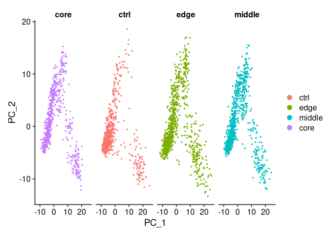

``` r
seurat_integrated <- RunUMAP(seurat_integrated, dims = 1:40, min.dist = 0.75, n.neighbors = 30)
```

    ## 14:55:03 UMAP embedding parameters a = 0.2734 b = 1.622

    ## 14:55:03 Read 3067 rows and found 40 numeric columns

    ## 14:55:03 Using Annoy for neighbor search, n_neighbors = 30

    ## 14:55:03 Building Annoy index with metric = cosine, n_trees = 50

    ## 0%   10   20   30   40   50   60   70   80   90   100%

    ## [----|----|----|----|----|----|----|----|----|----|

    ## **************************************************|
    ## 14:55:04 Writing NN index file to temp file /tmp/RtmpOW2YM0/file29f92f643219a7
    ## 14:55:04 Searching Annoy index using 1 thread, search_k = 3000
    ## 14:55:04 Annoy recall = 100%
    ## 14:55:05 Commencing smooth kNN distance calibration using 1 thread with target n_neighbors = 30
    ## 14:55:06 Initializing from normalized Laplacian + noise (using RSpectra)
    ## 14:55:06 Commencing optimization for 500 epochs, with 135402 positive edges
    ## 14:55:10 Optimization finished

``` r
UMAPPlot(seurat_integrated)   
```

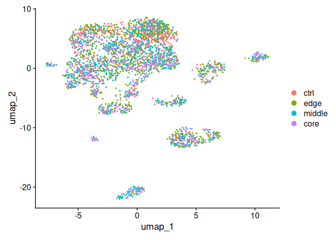 Now
we’ll check the clustering.

``` r
seurat_integrated <- FindNeighbors(object = seurat_integrated, 
                                dims = 1:40)
```

    ## Computing nearest neighbor graph

    ## Computing SNN

``` r
# Determine the clusters for various resolutions                                
seurat_integrated <- FindClusters(object = seurat_integrated,
                               resolution = c(0.05,0.1,0.2, 0.4))
```

    ## Modularity Optimizer version 1.3.0 by Ludo Waltman and Nees Jan van Eck
    ## 
    ## Number of nodes: 3067
    ## Number of edges: 161230
    ## 
    ## Running Louvain algorithm...
    ## Maximum modularity in 10 random starts: 0.9716
    ## Number of communities: 7
    ## Elapsed time: 0 seconds
    ## Modularity Optimizer version 1.3.0 by Ludo Waltman and Nees Jan van Eck
    ## 
    ## Number of nodes: 3067
    ## Number of edges: 161230
    ## 
    ## Running Louvain algorithm...
    ## Maximum modularity in 10 random starts: 0.9461
    ## Number of communities: 8
    ## Elapsed time: 0 seconds
    ## Modularity Optimizer version 1.3.0 by Ludo Waltman and Nees Jan van Eck
    ## 
    ## Number of nodes: 3067
    ## Number of edges: 161230
    ## 
    ## Running Louvain algorithm...
    ## Maximum modularity in 10 random starts: 0.9168
    ## Number of communities: 9
    ## Elapsed time: 0 seconds
    ## Modularity Optimizer version 1.3.0 by Ludo Waltman and Nees Jan van Eck
    ## 
    ## Number of nodes: 3067
    ## Number of edges: 161230
    ## 
    ## Running Louvain algorithm...
    ## Maximum modularity in 10 random starts: 0.8839
    ## Number of communities: 13
    ## Elapsed time: 0 seconds

``` r
Idents(object = seurat_integrated) <- "integrated_snn_res.0.05"
DimPlot(seurat_integrated,
        reduction = "umap",
        label = TRUE,
        label.size = 6)
```

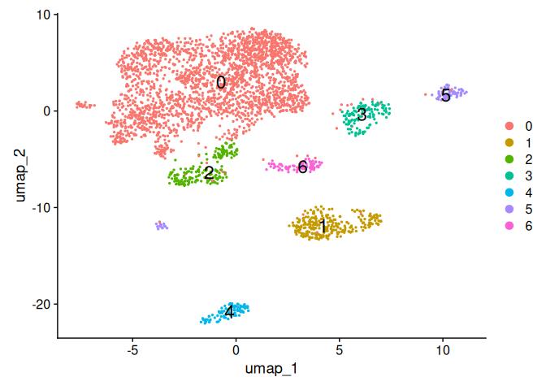

``` r
Idents(object = seurat_integrated) <- "integrated_snn_res.0.1"
DimPlot(seurat_integrated,
        reduction = "umap",
        label = TRUE,
        label.size = 6)
```

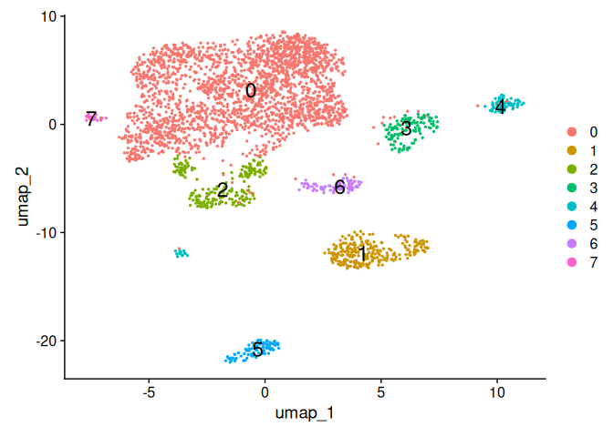

Using 0.4 makes sense here. Let’s check a cell phase:

``` r
# Explore whether clusters segregate by cell cycle phase
DimPlot(seurat_integrated,
        label = TRUE, 
        split.by = "Phase")  + NoLegend()
```

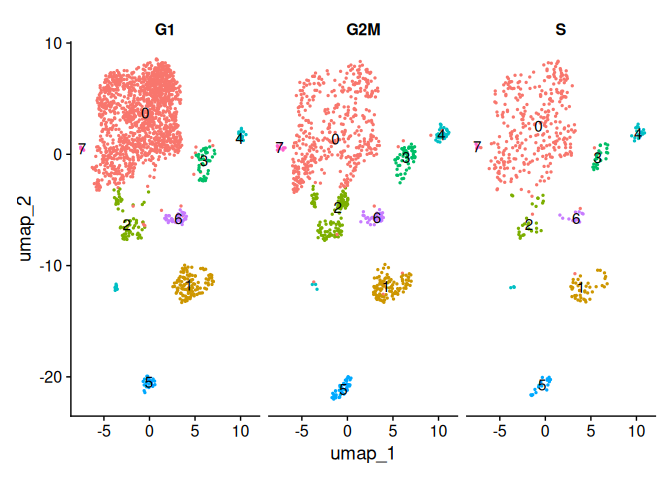 Each
of our clusters appear to be present in every cell state. In fact, G2M
seems to appear more segregated at lower cell counts.

Checking for uninteresting features.

``` r
# Determine metrics to plot present in seurat_integrated@meta.data
metrics <-  c("nUMI", "nGene", "S.Score", "G2M.Score", "mitoRatio")

FeaturePlot(seurat_integrated, 
            reduction = "umap", 
            features = metrics,
            pt.size = 0.4, 
            order = TRUE,
            min.cutoff = 'q10',
            label = TRUE)
```

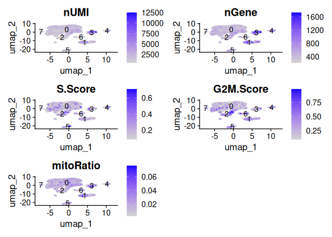 The
number of genes might be a defining factor for clusters to the right.

Next we’ll check cluster identity manually.

``` r
FeaturePlot(seurat_integrated, 
            reduction = "umap", 
            features = c("SMARCB1"), 
            order = TRUE,
            min.cutoff = 'q10', 
            label = TRUE)
```

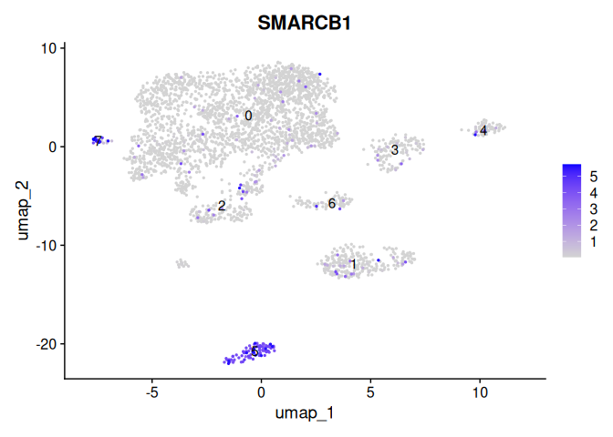

``` r
FeaturePlot(seurat_integrated, 
            reduction = "umap", 
            features = c("CD14", "LYZ"), 
            order = TRUE, 
            label = TRUE)
```

    ## Warning: Found the following features in more than one assay, excluding the
    ## default. We will not include these in the final data frame: CD14

    ## Warning: The following requested variables were not found: CD14

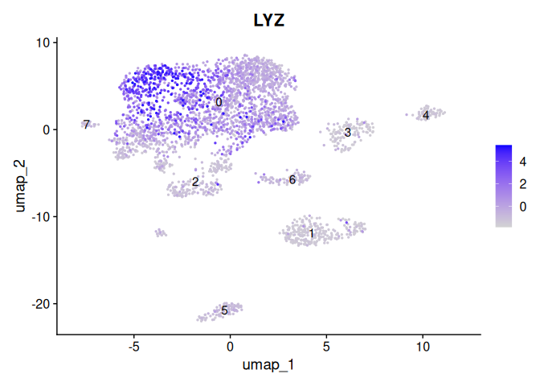
Finding cluster gene identities

``` r
DefaultAssay(seurat_integrated) <- "RNA"

# Create function to get conserved markers for any given cluster
get_conserved <- function(cluster, seurat){
  FindConservedMarkers(seurat,
                       ident.1 = cluster,
                       grouping.var = "sample",
                       only.pos = TRUE)
}
seurat_integrated.joined <- JoinLayers(seurat_integrated)
clusters <-  sapply(c(0:7),get_conserved, seurat = seurat_integrated.joined)
```

    ## Testing group core: (0) vs (4, 3, 6, 2, 1, 7, 5)

    ## For a (much!) faster implementation of the Wilcoxon Rank Sum Test,
    ## (default method for FindMarkers) please install the presto package
    ## --------------------------------------------
    ## install.packages('devtools')
    ## devtools::install_github('immunogenomics/presto')
    ## --------------------------------------------
    ## After installation of presto, Seurat will automatically use the more 
    ## efficient implementation (no further action necessary).
    ## This message will be shown once per session

    ## Testing group ctrl: (0) vs (1, 2, 4, 3, 6, 5)

    ## Testing group middle: (0) vs (3, 2, 6, 1, 5, 7, 4)

    ## Testing group edge: (0) vs (1, 3, 4, 7, 6, 5, 2)

    ## Testing group core: (1) vs (4, 3, 6, 0, 2, 7, 5)

    ## Testing group ctrl: (1) vs (0, 2, 4, 3, 6, 5)

    ## Testing group middle: (1) vs (3, 2, 6, 0, 5, 7, 4)

    ## Testing group edge: (1) vs (0, 3, 4, 7, 6, 5, 2)

    ## Testing group core: (2) vs (4, 3, 6, 0, 1, 7, 5)

    ## Testing group ctrl: (2) vs (0, 1, 4, 3, 6, 5)

    ## Testing group middle: (2) vs (3, 6, 0, 1, 5, 7, 4)

    ## Testing group edge: (2) vs (0, 1, 3, 4, 7, 6, 5)

    ## Testing group core: (3) vs (4, 6, 0, 2, 1, 7, 5)

    ## Testing group ctrl: (3) vs (0, 1, 2, 4, 6, 5)

    ## Testing group middle: (3) vs (2, 6, 0, 1, 5, 7, 4)

    ## Testing group edge: (3) vs (0, 1, 4, 7, 6, 5, 2)

    ## Testing group core: (4) vs (3, 6, 0, 2, 1, 7, 5)

    ## Testing group ctrl: (4) vs (0, 1, 2, 3, 6, 5)

    ## Testing group middle: (4) vs (3, 2, 6, 0, 1, 5, 7)

    ## Testing group edge: (4) vs (0, 1, 3, 7, 6, 5, 2)

    ## Testing group core: (5) vs (4, 3, 6, 0, 2, 1, 7)

    ## Warning: ctrl has fewer than 3 cells in Identity: 5. Skipping ctrl

    ## Testing group middle: (5) vs (3, 2, 6, 0, 1, 7, 4)

    ## Testing group edge: (5) vs (0, 1, 3, 4, 7, 6, 2)

    ## Testing group core: (6) vs (4, 3, 0, 2, 1, 7, 5)

    ## Testing group ctrl: (6) vs (0, 1, 2, 4, 3, 5)

    ## Testing group middle: (6) vs (3, 2, 0, 1, 5, 7, 4)

    ## Testing group edge: (6) vs (0, 1, 3, 4, 7, 5, 2)

    ## Testing group core: (7) vs (4, 3, 6, 0, 2, 1, 5)

    ## Warning: Identity: 7 not present in group ctrl. Skipping ctrl

    ## Testing group middle: (7) vs (3, 2, 6, 0, 1, 5, 4)

    ## Testing group edge: (7) vs (0, 1, 3, 4, 6, 5, 2)

``` r
# Iterate function across desired clusters
#conserved_markers <- purrr::map2_dfr(c(4,0,6,2), get_conserved, seurat = seurat_integrated)
```

Identifying Cell Type Clusters. Here are some intermediate results that
I’ve found via looking up gene marker identities on PangaoDB. Next steps
would be subclustering and comparing with a non-integrated dataset.

``` r
cluster.df.anno <- DataFrame(Cluster = c(0:7), 
                ID = c("Myeloid","Alveolar","Plasma: T Cells?","?","Fibroblasts", "Plasma", "T Cells", "?"), 
                Gene.Markers = c("LYZ, C1QA","PGR, SFTPB","CD3G, PRDM1","?","SLIT2, CRISPLD2","JCHAIN, SMARCB1, IGKC","SIGLEC6, FOXP1","?"))
cluster.df.anno
```

    ## DataFrame with 8 rows and 3 columns
    ##     Cluster               ID          Gene.Markers
    ##   <integer>      <character>           <character>
    ## 1         0          Myeloid             LYZ, C1QA
    ## 2         1         Alveolar            PGR, SFTPB
    ## 3         2 Plasma: T Cells?           CD3G, PRDM1
    ## 4         3                ?                     ?
    ## 5         4      Fibroblasts       SLIT2, CRISPLD2
    ## 6         5           Plasma JCHAIN, SMARCB1, IGKC
    ## 7         6          T Cells        SIGLEC6, FOXP1
    ## 8         7                ?                     ?
